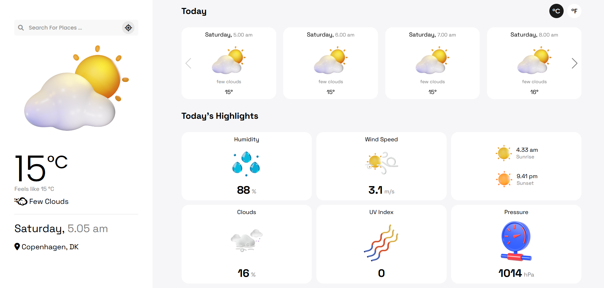

#  Frontend weather app

## 🖥 About
Smooth weather is a weather app with a great visual design, it supports searching locations by city name. 

### Demo - Deployed over Github Pages 
<a href="https://jkalbasri.github.io/frontend--weather-app/" target="blank" align="center"> 
Live Preview 🌐
</a>

<a href="https://jkalbasri.github.io/frontend--weather-app/" target="blank" align="center">
  <picture>
    <source media="(prefers-color-scheme: dark)" srcset="static/media/readme.png">
    
  </picture>
</a>

### APIs Used
[Open Weather APIs](https://openweathermap.org/)

### API Info
* Method: `GET`
* URL: `https://api.openweathermap.org/data/2.5/weather?`
---
## [AA](http://albasri.dk/)
